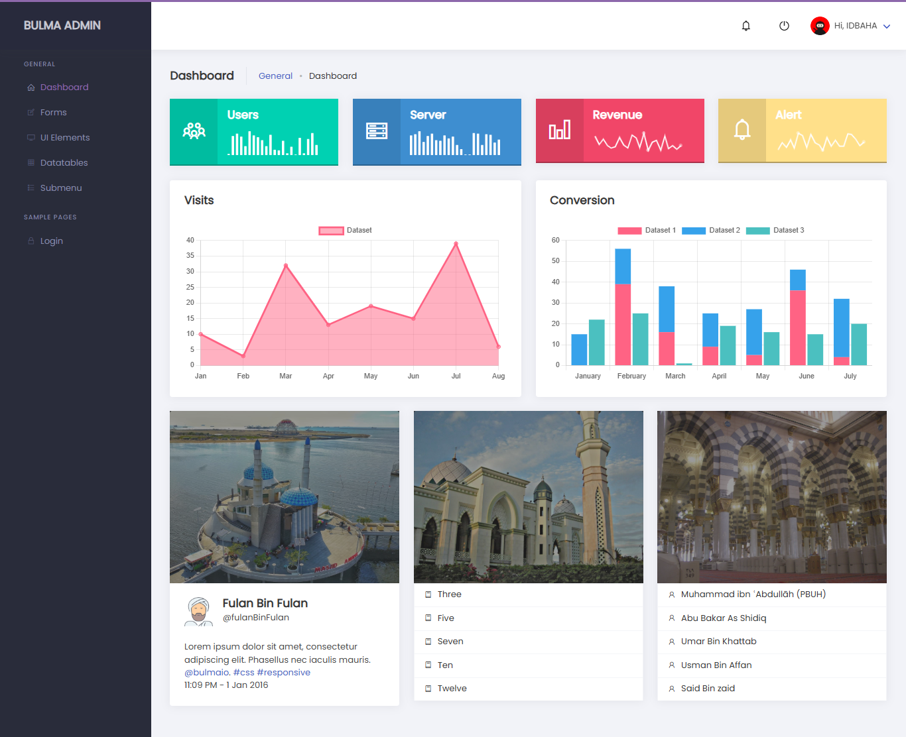

# 🚀 Bulma Admin Dashboard Template

<div align="center">
  
  
  
  
  
  
</div>

<div align="center">
  <br />
  
  <br />
  <br />
  <p><strong>A clean, elegant, and responsive admin dashboard template built with Bulma CSS framework</strong></p>
</div>

## ✨ Features

- 📱 Fully responsive design - works on all devices
- 🎨 Clean and modern UI based on Bulma CSS
- 📊 Interactive charts using Chart.js
- 📈 Sparkline statistics
- 📋 DataTables integration with search and pagination
- 🧩 Modular and easy to customize
- 🔍 Search functionality
- 📝 Various form elements and validations
- 🎛️ UI components showcase
- 🏷️ Various UI elements (buttons, tags, notifications, etc.)
- 📦 No complex build tools required

## 📋 Pages Included

- **Dashboard** - Overview with statistics, charts and widgets
- **Forms** - Various form elements, validations and styles
- **UI Elements** - Collection of UI components and styles
- **DataTables** - Interactive tables with search and pagination

## 🚀 Quick Start

1. **Clone this repository**
   ```bash
   git clone https://github.com/idbaha-lahoucine96/Dashboard-Template.git
   ```

2. **Navigate to the project folder**
   ```bash
   cd Dashboard-Template
   ```

3. **Open the index.html file in your browser**
   ```bash
   open index.html
   ```

## 🧩 Dependencies

- [Bulma CSS](https://bulma.io/) - Modern CSS framework
- [Font Awesome](https://fontawesome.com/) - Icon library
- [jQuery](https://jquery.com/) - JavaScript library
- [Chart.js](https://www.chartjs.org/) - JavaScript charting library
- [jQuery Sparklines](https://omnipotent.net/jquery.sparkline/) - Tiny charts
- [DataTables](https://datatables.net/) - Table plugin for jQuery
- [SweetAlert2](https://sweetalert2.github.io/) - Beautiful alerts and modals

## 📂 Project Structure

```
bulma-admin/
├── css/                  # CSS files
│   └── app.css           # Main application styles
├── images/               # Image assets
├── js/                   # JavaScript files
│   └── app.js            # Main application scripts
├── vendor/               # External libraries
├── datatables.html       # DataTables page
├── elements.html         # UI Elements page
├── forms.html            # Forms page
└── index.html            # Dashboard page
```

## 🎨 Customization

### Colors

The template uses Bulma's color variables which can be customized in your own CSS:

```css
/* Example of color customization */
:root {
  --primary: #00d1b2;
  --info: #209cee;
  --success: #23d160;
  --warning: #ffdd57;
  --danger: #ff3860;
}
```

### Layout

The layout is built using Bulma's grid system. You can modify the columns structure by changing the `is-2` and `is-10` classes for sidebar and content areas.

### Dashboard Widgets

Add or remove widgets by modifying the columns in the dashboard layout.

## 🔧 Browser Support

- Chrome (latest)
- Firefox (latest)
- Safari (latest)
- Edge (latest)
- Opera (latest)

## 📧 Contact

For any questions or feedback, please reach out:

- GitHub: [idbaha-lahoucine96](https://github.com/idbaha-lahoucine96)
- LinkedIn: [IDBAHA LAHOUCINE](https://eh.linkedin.com/in/idbaha-lahoucine-b26a81283)

## 🙏 Acknowledgements

- [Bulma.io](https://bulma.io/)
- [FontAwesome](https://fontawesome.com/)
- [Unsplash](https://unsplash.com/) for demo images

---

<div align="center">
  <p>Made with ❤️ by <a href="https://eh.linkedin.com/in/idbaha-lahoucine-b26a81283">IDBAHA LAHOUCINE</a></p>
  <p>Don't forget to ⭐ this repository if you found it useful!</p>
</div>
